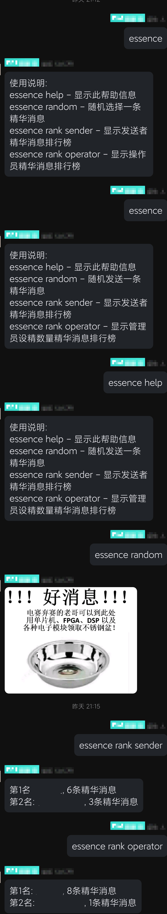

  
   
  

# nonebot-plugin-essence-message

_✨ 用于整理精华消息 ✨_

## 📖 介绍

如果你群有精华消息过多的困扰, 可以考虑使用此插件.

## 💿 安装

使用 nb-cli 安装

在 nonebot2 项目的根目录下打开命令行, 输入以下指令即可安装

    nb plugin install nonebot-plugin-essence-message

使用包管理器安装

在 nonebot2 项目的插件目录下, 打开命令行, 根据你使用的包管理器, 输入相应的安装命令

pip

    pip install nonebot-plugin-essence-message

打开 nonebot2 项目根目录下的 `pyproject.toml` 文件, 在 `[tool.nonebot]` 部分追加写入

    plugins = ["nonebot_plugin_essence_message"]

## 🎉 使用
### 指令表
| 指令 | 权限 | 需要@ | 范围 | 说明 |
|:-----:|:----:|:----:|:----:|:----:|
| essence help | 群员 | 否 | 群聊 | 显示所有可用指令及其说明 |
| essence random | 群员 | 否 | 群聊 | 随机发送一条精华消息 |
| essence rank sender | 群员 | 否 | 群聊 | 显示发送者精华消息排行榜 |
| essence rank operator | 群员 | 否 | 群聊 | 显示管理员设精数量精华消息排行榜 |
### 效果图

