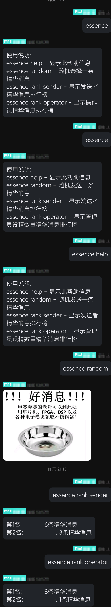

  
   
  

# nonebot-plugin-essence-message

_✨ 用于整理精华消息 ✨_

## 📖 介绍

如果你群有精华消息过多的困扰, 可以考虑使用此插件.  
请注意，此插件可能进一步推进你群精华消息通货膨胀。

## ⚠️ 注意事项

**📊 数据库结构变更提示**
1. 在从较旧的版本更新到0.6.0时, 涉及以下数据库结构调整：
   - user_mapping 新增 `UNIQUE` 唯一性约束（nickname + group_id + user_id 组合）
2. 程序启动时会自动完成数据库结构的转换
3. 务必手动备份 SQLite 数据库文件, 数据库文件在nonebot_plugin_localstore给出的插件数据目录的中的essence_message子目录下, 文件名为essence_message.db
4. 根据[Nonebot文档](https://nonebot.dev/docs/best-practice/data-storing)以下是默认插件数据目录    
    - macOS: `~/Library/Application` Support/nonebot2
    - Unix: `~/.local/share/nonebot2` or in `$XDG_DATA_HOME`, if defined
    - Win XP (not roaming): `C:\Documents and Settings\<username>\Application Data\nonebot2`
    - Win 7 (not roaming): `C:\Users\<username>\AppData\Local\nonebot2`

## 💿 安装

使用 nb-cli 安装

在 nonebot2 项目的根目录下打开命令行, 输入以下指令即可安装

    nb plugin install nonebot_plugin_essence_message

使用包管理器安装

在 nonebot2 项目的插件目录下, 打开命令行, 根据你使用的包管理器, 输入相应的安装命令

pip

    pip install nonebot_plugin_essence_message

打开 nonebot2 项目根目录下的 `pyproject.toml` 文件, 在 `[tool.nonebot]` 部分追加写入

    plugins = ["nonebot_plugin_essence_message"]

## ⚙️ 配置

在 nonebot2 项目的`.env`文件中添加下表中的必填配置

|           配置项            | 必填  | 默认值 |                                 说明                                  |
| :-------------------------: | :---: | :----: | :-------------------------------------------------------------------: |
|    essence_random_limit     |  否   |   5    |                  `essence random` 指令的使用次数上限                  |
|   essence_random_cooldown   |  否   |   5    |                `essence random` 指令的使用次数冷却时间                |
|    essence_enable_groups    |  否   |  all   |              启用群号列表，默认为 `all` 表示所有群都启用              |
| good_essence_enable_groups  |  否   |   []   | 是否启用n赞加精功能,会对点赞数超过good_bound的消息自动加精,默认不启用 |
|         good_bound          |  否   |   3    |                                 如上                                  |
| whale_essnece_enable_groups |  否   |   []   |      是否使用Reaction🐳代替设精,用于防止精华消息过于泛滥导致刷屏       |

如果要寻找数据库和缓存的位置,请参考nonebot文档的[data-storing](https://nonebot.dev/docs/best-practice/data-storing)章节
## 🎉 使用
### 指令表
| 指令                    | 权限   | 需要@ | 范围 | 说明                                 |
| ----------------------- | ------ | ----- | ---- | ------------------------------------ |
| `essence help`          | 群员   | 否    | 群聊 | 显示所有可用指令及其说明             |
| `essence random`        | 群员   | 否    | 群聊 | 随机发送一条精华消息                 |
| `essence rank sender`   | 群员   | 否    | 群聊 | 显示发送者精华消息排行榜             |
| `essence rank operator` | 群员   | 否    | 群聊 | 显示管理员设精数量排行榜             |
| `essence fetchall`      | 管理员 | 否    | 群聊 | 获取群内所有精华消息并存储到数据库   |
| `essence export`        | 管理员 | 否    | 群聊 | 导出当前群的精华消息数据库文件       |
| `essence search <str>`  | 群员   | 否    | 群聊 | 根据关键词搜索精华消息               |
| `essence migrate <int>` | 管理员 | 否    | 群聊 | 将指定群号的精华消息迁移到本群       |
| `essence saveall`       | 管理员 | 否    | 群聊 | 将群内所有精华消息中的图片保存至本地 |
| `essence switch`        | 管理员 | 否    | 群聊 | 更改数据库和群聊的跟随状态           |
| `essence clean`         | 管理员 | 否    | 群聊 | 删除群里所有精华消息（数据库中保留） |
*在先前的版本中只有essence clean可以不清理数据库的删除群内精华消息, 但是现实的bot有很多情况. 当onebot实现并不能很好的按预期运行时, 可以使用essence switch指令用于手动清理群内精华

### 精华事件
- 本插件在正常工作时, 会对精华消息做出响应, 随之把消息存入或删除数据库.  
- 当精华消息空间满了之后,可以使用essence clean删除精华消息, 这次清理不会删除数据库中的精华消息.
- 如果essence clean不能正常工作, 需要先essence switch确保qq中的精华消息不会影响数据库, 然后手动清理, 然后再运行一次essence switch

### Reaction事件
- 本插件在正常工作时,会对🐳(code:128051)和👍(code:74)做出响应.  
- 如果启用了n赞加精功能,此功能会对点赞数超过good_bound的消息自动加精,使得每个群友都有设精权  
- 如果启用了 whale-essnece 功能,此功能会对管理员(包括SUPERUSER,群主和群管理员)的🐳(code:128051)Reaction事件做出反应,把该条消息放入数据库,并回复一个✨(code:10024)表示操作完成
- 如果两个功能同时启用,n赞加精会用🐳代替设精  
*此功能的正常运行需要reaction作为一个onebot的event事件传入nonebot, 通过最近几个版本的热门onebot的实现似乎都不能很好的运行此功能. 因此暂时不建议开启

### 效果图

